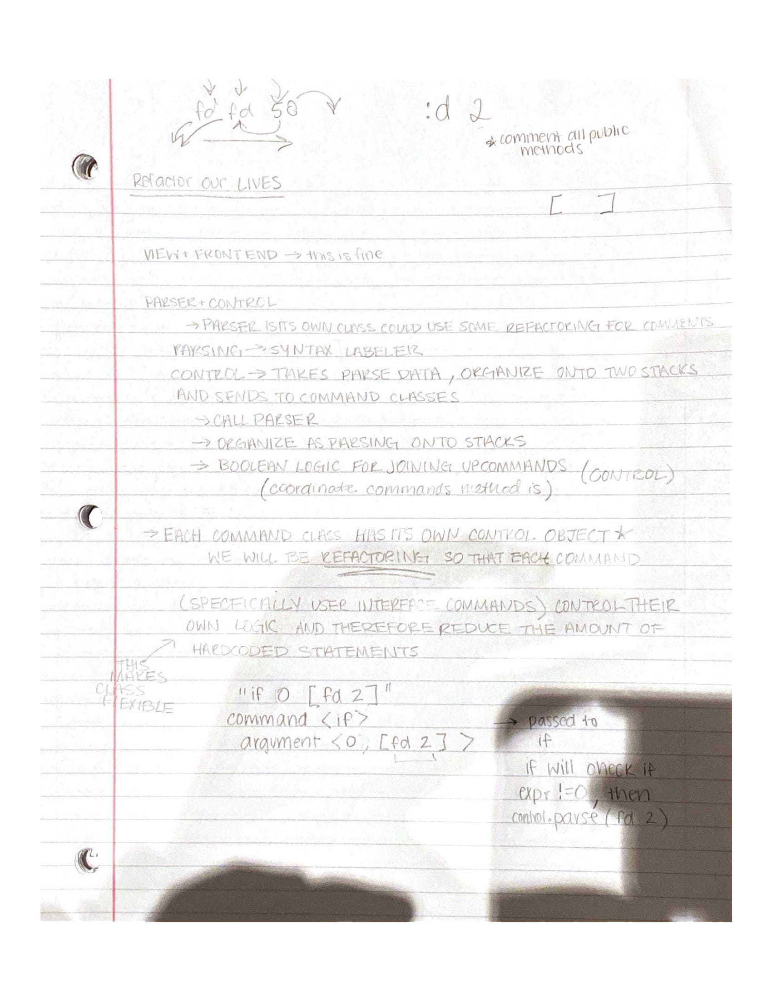

parser - team 17
====
This project implements a development environment that helps users write SLogo programs.

Names: Libba Lou, Cayla Schuval, Aneesh Gupta, Turner Jordan

### Timeline
Start Date: February 20th, 2020

Finish Date (Basic Implementation): February 26th, 2020

Hours Spent: 60

### Primary Roles
Libba Lou: Implementing the Controller module to interface between the front end and back end components. This includes implementing the Parser class to parse command strings taken from the front end.

Cayla Schuval: Responsible for implementing the entire front end package

Turner Jordan: Back-end package

Aneesh Gupta: Back-end package

### Resources Used
The CS308 Piazza board and lectures, Java and JavaFX documentation, and stack overflow for small fixes. 

### Running the Program
Main class: View

Data files needed: English.properties (and all other language property files), mover.png

Features implemented: Features described in the basic implementation (including commands in the command specification document)

### Notes/Assumptions
Assumptions or Simplifications: Currently, the FOR user input command does not work. We plan to refactor our current code to have command objects taking in and handling the logic for these types of commands, rather than having that done in the control class (where it currently resides). This will allow us to better implement all user commands, and fix problems with the FOR user command that exist. The plan for refactoring is described in the image below.

Interesting data files: NA

Known Bugs: NA

Extra credit: NA

### Impressions
Coming for complete implementation
